# Simple Docker

## Оглавление

[Часть 1. Готовый докер](#часть-1-готовый-докер)  
[Часть 2. Операции с контейнером](#часть-2-операции-с-контейнером)  
[Часть 3. Мини веб-сервер](#часть-3-мини-веб-сервер)  
[Часть 4. Свой докер](#часть-4-свой-докер)  
[Часть 5. Dockle](#часть-5-dockle)  
[Часть 6. Базовый Docker Compose](#часть-6-базовый-docker-compose)  

## Часть 1. Готовый докер

- Скачиваю [официальный](https://hub.docker.com/_/nginx) ngnix образ `docker pull nginx` и проверяю наличие образа `docker images`

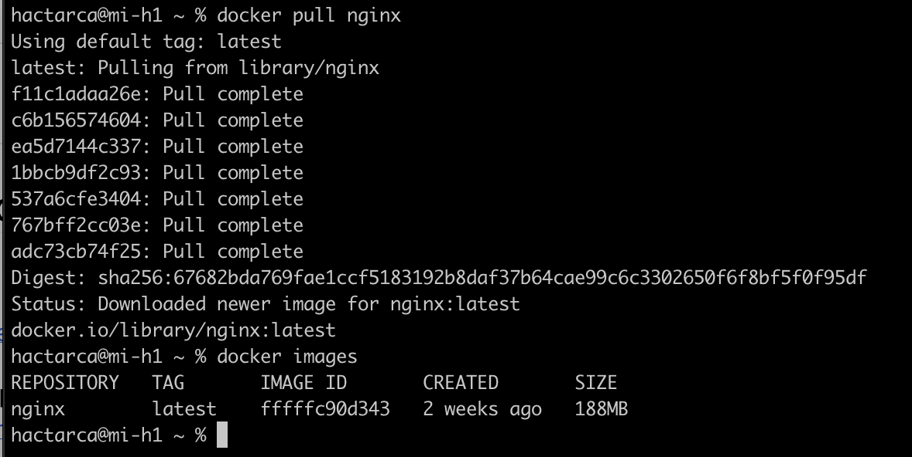

- Запускаю образ `docker run -d nginx` и проверяю, что образ запущен `docker ps`

> -d - запуск контейнера в фоновом режиме

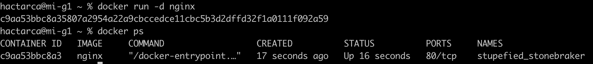

- Информация о контейнере `docker inspect -s`

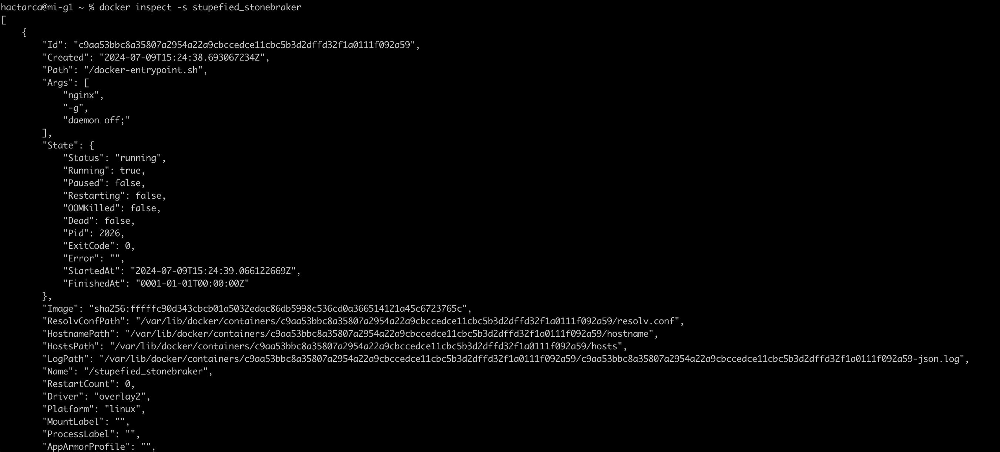

> -s --size, добавляет в окно настройки два дополнительных поля

- Размер контейнера

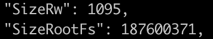

> SizeRootFs: общий размер всех файлов в контейнере в байтах

> SizeRw: размер файлов, созданных или измененных в контейнере, по сравнению с его образом, в байтах

- Список портов

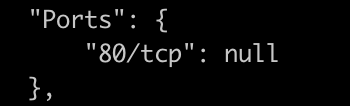

- ip контейнера

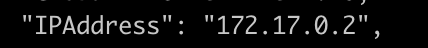

- Останавливаю контейнер `docker stop`

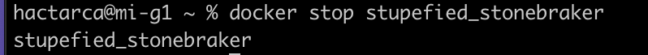

- Проверяю, что образ остановлен `docker ps`

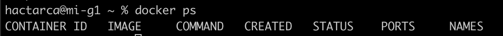

- Запускаю контейнер с замапленными портами 80 и 443

`docker run -d -p 80:80 -p 443:443 nginx`

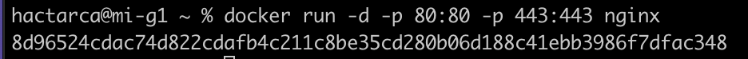

> -p: используется для публикации портов из контейнера на хост

> -p 80:80сопоставляет порт 80 на хосте с портом 80 в контейнере и также для порта 443

> "Замапить порт" - переадресация принимаемых данных таким образом, чтобы данные, принимаемые на какой-то порт одного компьютера автоматически переадресовывались на какой-то другой порт другого компьютера

- Проверяю стартовую страницу в бразузере

- Перезапускаю контейнер `docker restart` и проверяю, что образ перезапущен `docker ps`

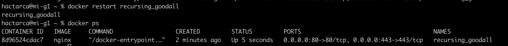

## Часть 2. Операции с контейнером

- Читаю конфигурационный файл

> docker exec используется для выполнения команды в работающем контейнере

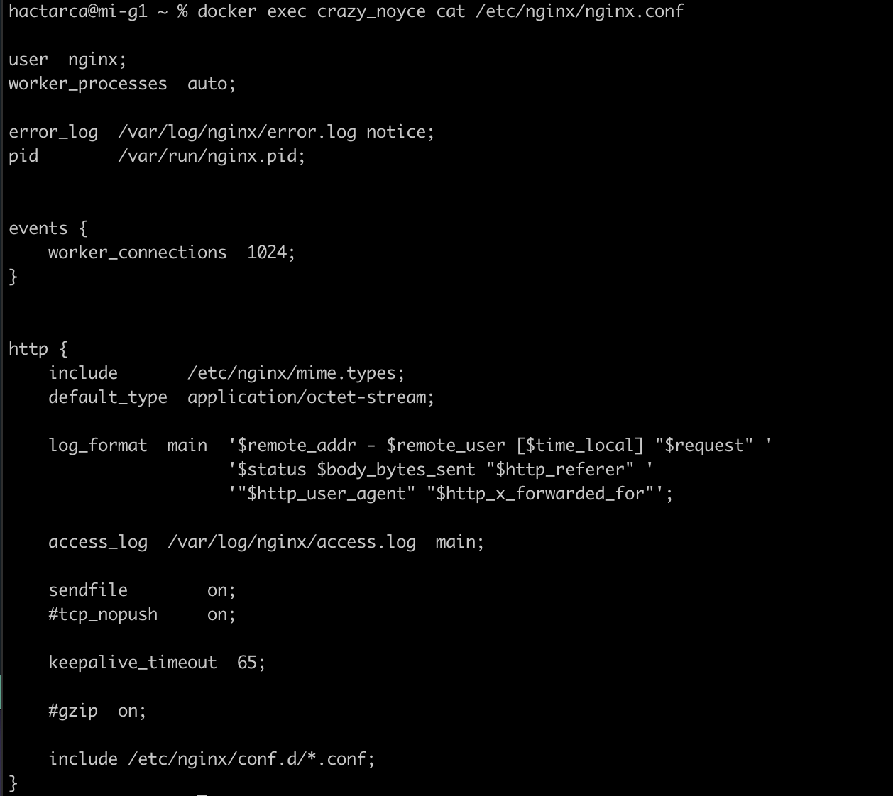

- Создаю на локальной машине конфигурационный файл `touch nginx.conf`

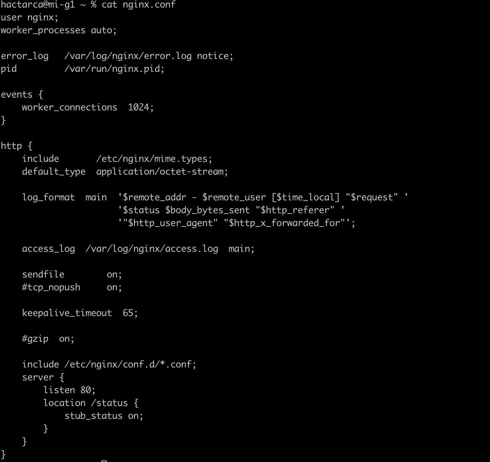

- Копирую файл в nginx `docker cp`

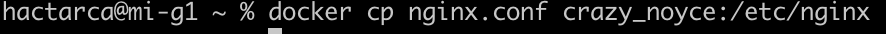

- Перезапускаю nginx `nginx -s reload` и проверяю, что все работает 

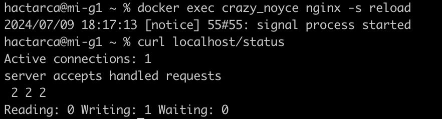

- Экспортирую контейнер `docker export` и останавливаю контейнер `docker stop`

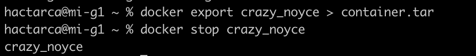

- Удаляю образ `docker rmi`, удаляю контейнер `docker rm`

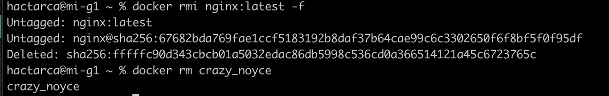

> Флаг -f — это принудительный флаг, который приводит к удалению образа Docker без подтверждения. Он используется, чтобы избежать интерактивного запроса на подтверждение удаления.

- Импортирую образ `docker import`

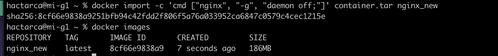

- Запускаю контейнер `docker run` и проверяю, что все работает 

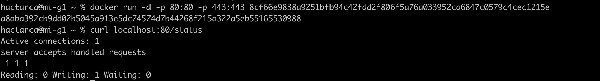

## Часть 3. Мини веб-сервер

- Чтобы создать свой мини веб-сервер, необходимо создать `.c` файл, в котором будет описана логика сервера (в нашем случае - вывод сообщения Hello World!), а также конфиг `nginx.conf`, который будет проксировать все запросы с порта `81` на порт `127.0.0.1:8080`

`server.c`

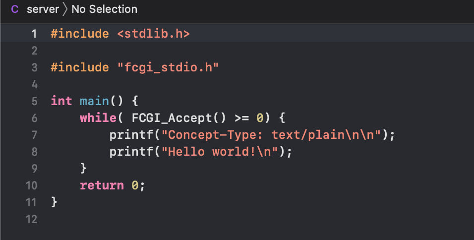

`nginx.conf`

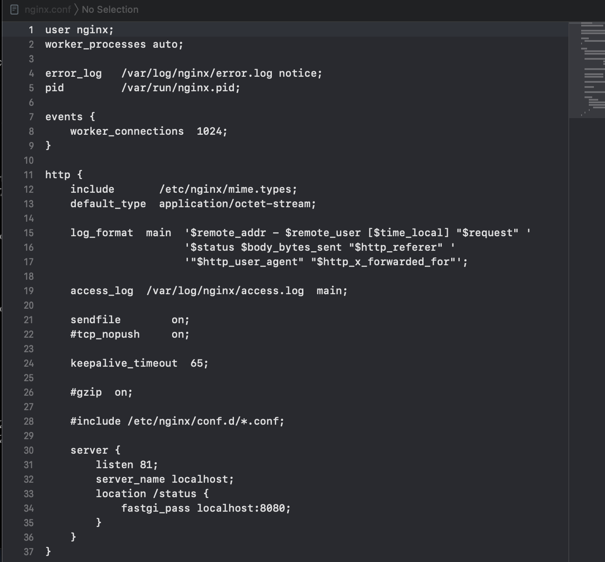

- Запускаю контейнер `docker run`, при этом образ ngnix (https://hub.docker.com/_/nginx) автоматически подтягивается 

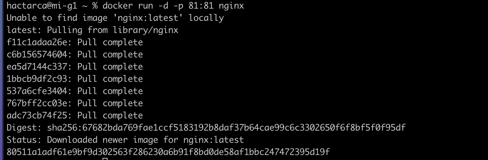

- Копирую файл сервера и конфигурационный файл в контейнер `docker cp`

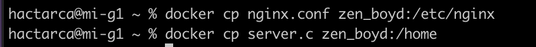

- Устанавливаю необходимые пакеты в контейнер

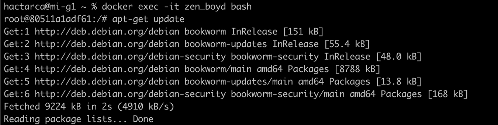

- Компилирую, запускаю и перезапускаю сервер `nginx -s reload`

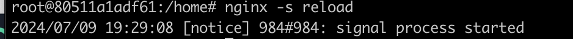

- Проверяю, что все работает запускаю в браузере `localhost:81`

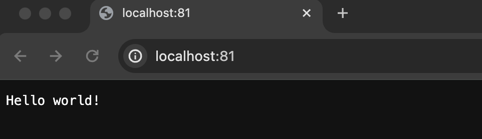

## Часть 4. Свой докер

- Напишем свой docker-образ, который собирает исходники 3-й части, запускает на порту 80, после копирует внутрь написанный нами `nginx.conf` и, наконец, запускает nginx (ниже приведены файлы `run.sh` и `Dockerfile`, файлы `nginx.conf` и `server.c` остаются с 3-й части)

`run.sh`

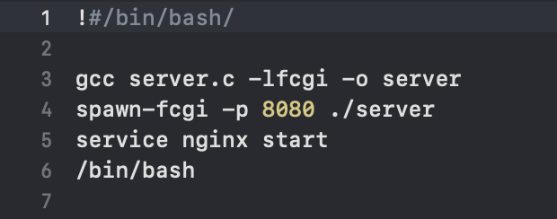

`Dockerfile`

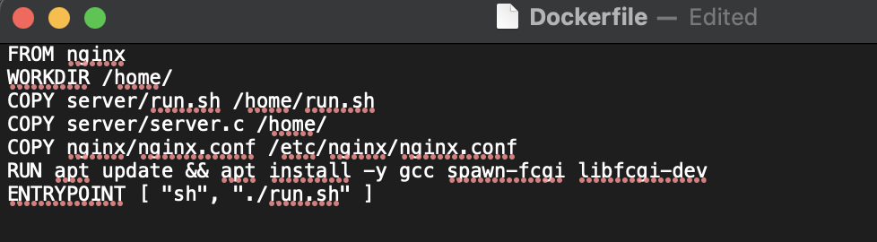

- Собираю образ `docker build` и проверяю его наличие `docker images`

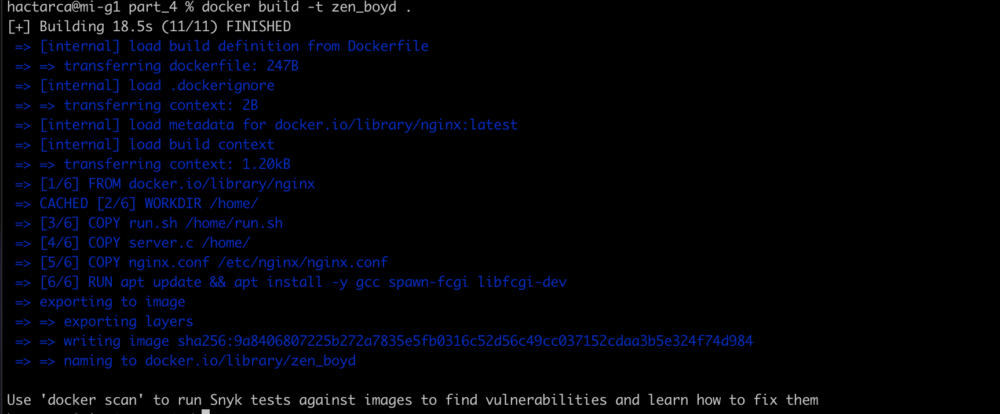

> -t: Имя и при необходимости тег в формате name:tag

- Запускаю контейнер `docker run`, проверяю, что все работает `docker ps`, cмотрю `curl localhost`

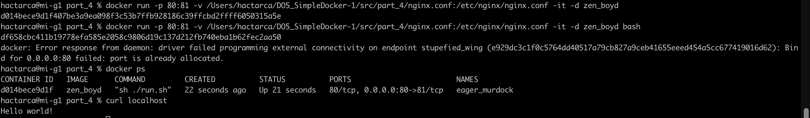

> -v: Привязка монтирования тома

> -i: Держит STDIN открытым, даже если он не подключен

> -t: Выделение псевдо-TTY

> -p: Публикация портов контейнера на хосте

- Теперь добавим в файл `nginx.conf` проксирование странички `/status`, по которой необходимо отдавать статус сервера `nginx`

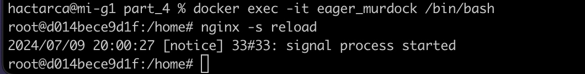

- Проверяю `localhost/status`

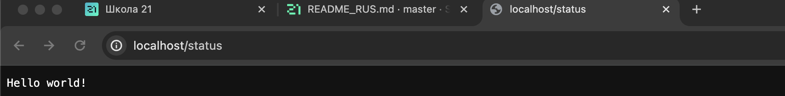

## Часть 5. Dockle

- Проверяю образ `salamandra_marth:1.0`

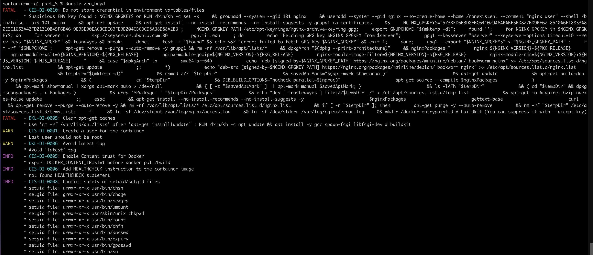

- После правки всех `FATATL` and `WARN` проверяю новый образ с исправлениями `salamandra_marth:2.0`

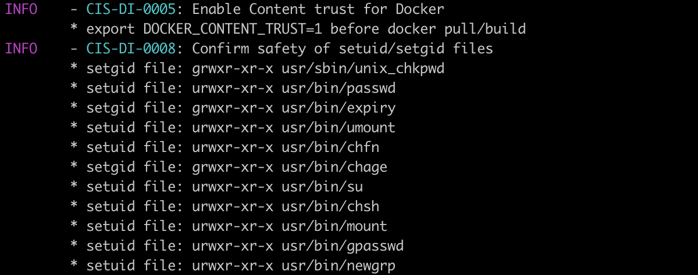

## Часть 6. Базовый Docker Compose

- Для начала остановим все запущенные контейнеры командой `docker stop`

- Затем изменим и дополним конфигурационные файлы

- Собираю образы `docker compose build`

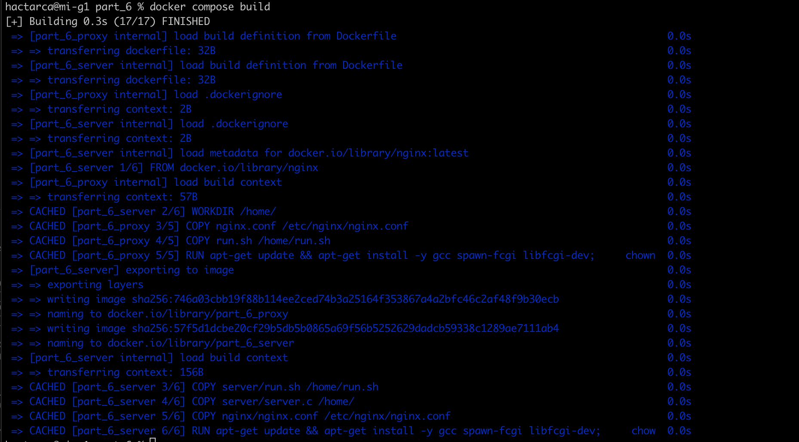

- Запускаю контейнеры и проверяю, что все работает `docker compose up -d`, `curl localhost:80`, `curl localhost/status`

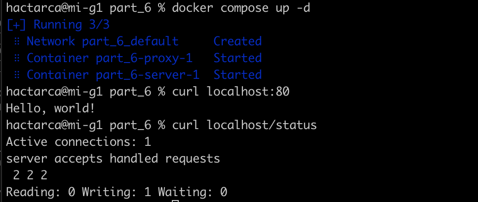

> -d: deamon

[Оглавление](#Оглавление)